# Microsoft Graph API Integration - OneDrive for Business Read Access
## Solution Design Document

---

## Overview

This solution enables an external application (ChatGPT) to read files from OneDrive for Business using Microsoft Graph API with OAuth2 client credentials flow. The integration provides read-only access to files, file lists, and metadata.

### Solution Overview

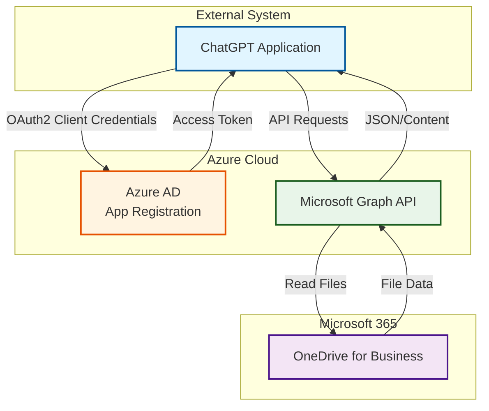

### Key Features

- ✅ **Read-Only Access** - List files, read content, get metadata
- ✅ **No User Interaction** - App-only authentication (client credentials)
- ✅ **Secure** - OAuth2 with Azure AD integration
- ✅ **Simple Integration** - RESTful API with standard HTTP methods

---

## Architecture

### System Architecture Diagram

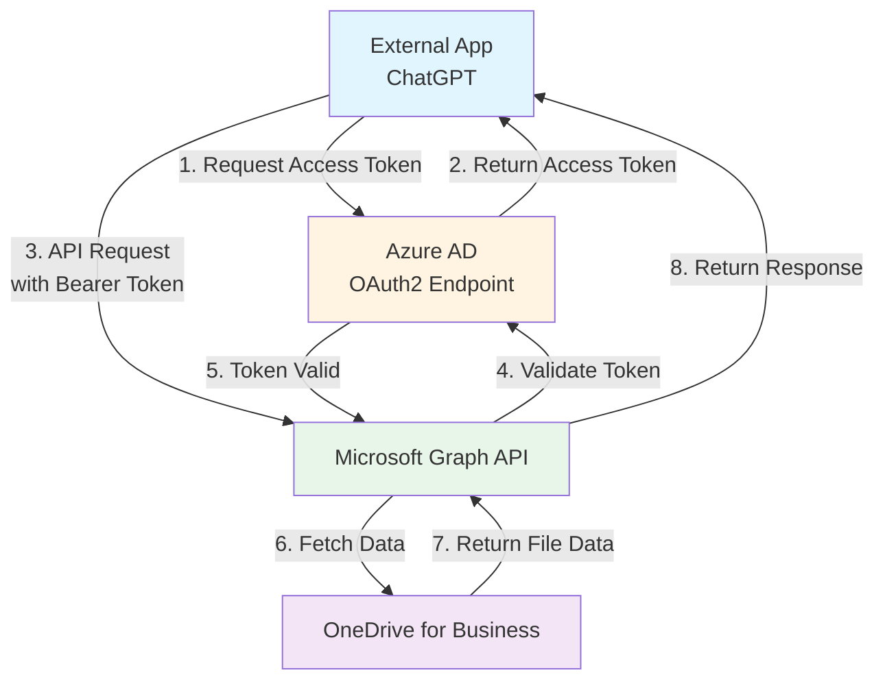

### Component Interaction Flow

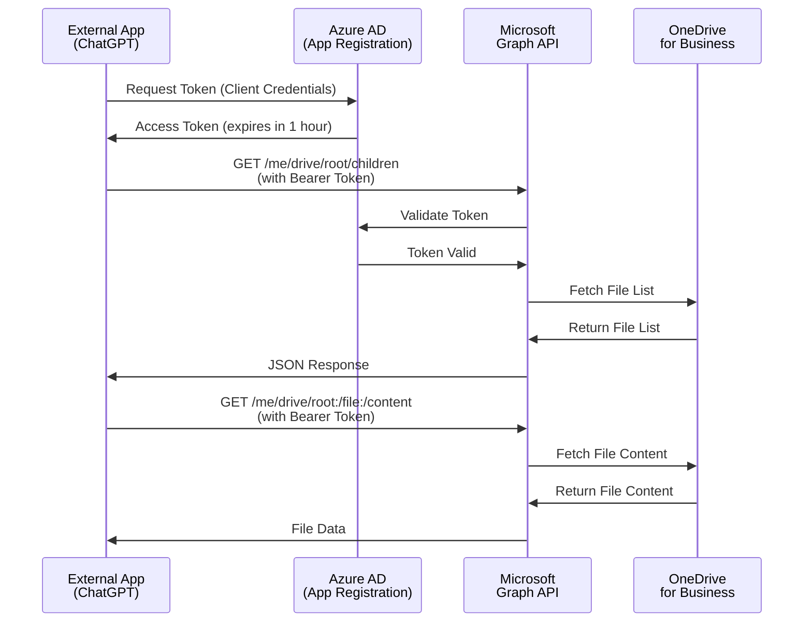

**Authentication Flow:** OAuth2 Client Credentials (App-only authentication)

---

## Step 1: Azure App Registration Setup

### 1.1 Azure Portal Navigation Flow

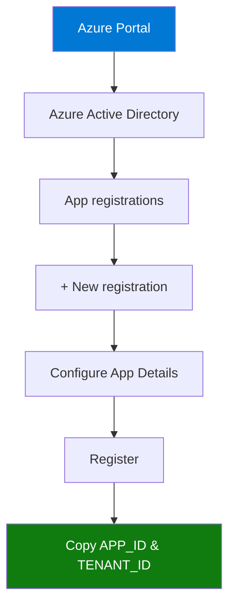

### 1.2 Create App Registration

1. Navigate to [Azure Portal](https://portal.azure.com)
2. Go to **Azure Active Directory** → **App registrations**
3. Click **+ New registration**
4. Configure:
   - **Name:** `OneDrive-Read-Only-Integration` (or your preferred name)
   - **Supported account types:** `Accounts in this organizational directory only`
   - **Redirect URI:** Leave blank (not needed for client credentials flow)
5. Click **Register**

### 1.3 Record Application IDs

After registration, note down:
- **Application (client) ID** - This is your `APP_ID`
- **Directory (tenant) ID** - This is your `TENANT_ID`

**Location in Azure Portal:**
```
App Registration → Overview → Application (client) ID
App Registration → Overview → Directory (tenant) ID
```

---

## Step 2: Configure Application Permissions

### 2.1 Permission Configuration Flow

```mermaid
flowchart LR
    A[App Registration] --> B[API Permissions]
    B --> C[+ Add Permission]
    C --> D[Microsoft Graph]
    D --> E[Application Permissions]
    E --> F[Files.Read.All]
    F --> G[Add Permissions]
    G --> H[Grant Admin Consent]
    H --> I[✓ Permission Granted]
    
    style I fill:#107c10,color:#fff
    style H fill:#ffb900
```

### 2.2 Add Microsoft Graph API Permissions

1. In your App Registration, go to **API permissions**
2. Click **+ Add a permission**
3. Select **Microsoft Graph**
4. Choose **Application permissions** (not Delegated)
5. Add the following permissions:
   - `Files.Read.All` - Read all files that the app can access
6. Click **Add permissions**

### 2.3 Grant Admin Consent

⚠️ **Critical Step:** You must grant admin consent for the permissions to work.

1. In the **API permissions** page, click **Grant admin consent for [Your Organization]**
2. Click **Yes** to confirm
3. Verify that the status shows "Granted for [Your Organization]" with a green checkmark

**Visual Status Check:**
```
✅ Files.Read.All
   Type: Application
   Status: Granted for [Your Organization]
```

---

## Step 3: Create Client Secret

### 3.1 Secret Generation Process

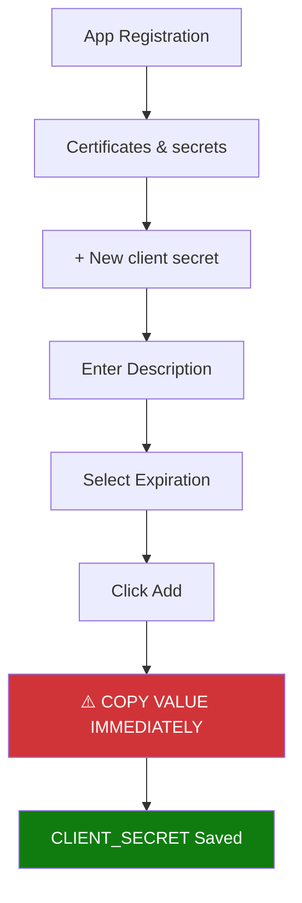

### 3.2 Generate Secret

1. In your App Registration, go to **Certificates & secrets**
2. Click **+ New client secret**
3. Configure:
   - **Description:** `OneDrive Read Access Secret`
   - **Expires:** Choose your preferred duration (6 months, 12 months, or 24 months)
4. Click **Add**
5. **⚠️ IMPORTANT:** Copy the **Value** immediately (it won't be shown again)
   - This is your `CLIENT_SECRET`

**Note:** The secret value is only displayed once. Store it securely immediately.

---

## Step 4: Required Credentials Summary

### 4.1 Credentials Overview

After completing the above steps, you will have three essential credentials:

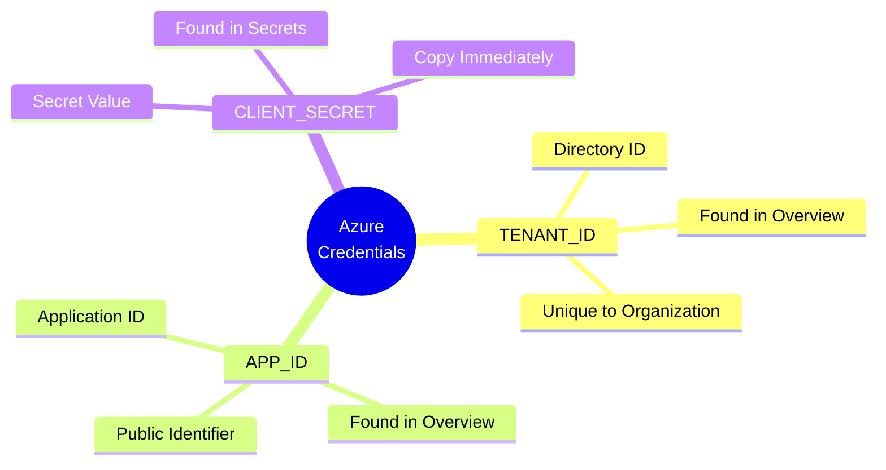

### 4.2 Credentials Reference Table

| Credential | Description | Where to Find | Example Format |
|------------|-------------|---------------|----------------|
| **TENANT_ID** | Your Azure AD tenant ID | App Registration → Overview → Directory (tenant) ID | `xxxxxxxx-xxxx-xxxx-xxxx-xxxxxxxxxxxx` |
| **APP_ID** | Application (client) ID | App Registration → Overview → Application (client) ID | `xxxxxxxx-xxxx-xxxx-xxxx-xxxxxxxxxxxx` |
| **CLIENT_SECRET** | Client secret value | App Registration → Certificates & secrets → Value | `~AbCdEf123456...` |

### 4.3 Security Storage

Store these credentials securely:
- ✅ Environment variables
- ✅ Secure configuration files
- ✅ Azure Key Vault (production)
- ❌ Never commit to version control
- ❌ Never share in plain text

---

## Step 5: Microsoft Graph API Endpoints

### 5.1 API Endpoint Architecture

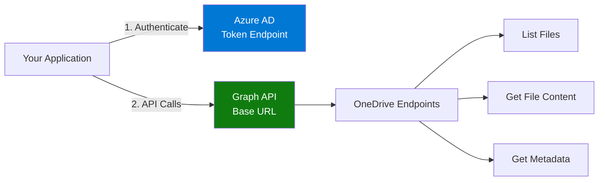

### 5.2 Authentication Endpoint

**Base URL:**
```
https://login.microsoftonline.com/{TENANT_ID}/oauth2/v2.0/token
```

**Method:** `POST`  
**Content-Type:** `application/x-www-form-urlencoded`

### 5.3 OneDrive API Endpoints

**Base URL:** `https://graph.microsoft.com/v1.0`

| Operation | Endpoint | Method | Description |
|-----------|----------|--------|-------------|
| **List Root Files** | `/me/drive/root/children` | GET | List all files and folders in OneDrive root |
| **List Folder** | `/me/drive/root:/{folder-path}:/children` | GET | List files in a specific folder |
| **Get File Content** | `/me/drive/root:/{file-path}:/content` | GET | Download file content by path |
| **Get File Metadata** | `/me/drive/root:/{file-path}` | GET | Get file metadata by path |
| **Get File by ID** | `/me/drive/items/{item-id}/content` | GET | Download file content by item ID |
| **Get Metadata by ID** | `/me/drive/items/{item-id}` | GET | Get file metadata by item ID |

**Example Endpoints:**
- List files: `GET https://graph.microsoft.com/v1.0/me/drive/root/children`
- Get file: `GET https://graph.microsoft.com/v1.0/me/drive/root:/Documents/report.pdf:/content`

---

## Step 6: Authentication Flow

### 6.1 OAuth2 Client Credentials Flow

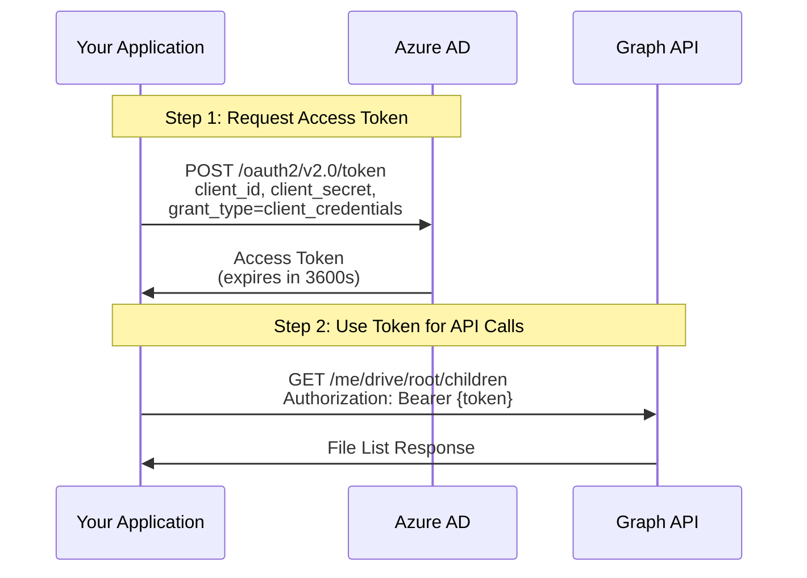

### 6.2 Token Request Details

**Request Parameters:**
| Parameter | Value | Description |
|-----------|-------|-------------|
| `client_id` | Your APP_ID | Application identifier |
| `scope` | `https://graph.microsoft.com/.default` | Required scope for Graph API |
| `client_secret` | Your CLIENT_SECRET | Application secret |
| `grant_type` | `client_credentials` | OAuth2 grant type |

**Response Structure:**
```json
{
  "token_type": "Bearer",
  "expires_in": 3600,
  "access_token": "eyJ0eXAiOiJKV1QiLCJub..."
}
```

### 6.3 Using the Access Token

Include the token in the `Authorization` header for all Graph API requests:

```
Authorization: Bearer {access_token}
```

**Token Lifetime:** 3600 seconds (1 hour)

---

## Step 7: Implementation Examples

### 7.1 Code Implementation Overview

For complete working code examples, refer to:
- **Python Implementation:** `onedrive_reader.py` (included in this project)
- **Postman Collection:** `Postman_Collection.json` (for API testing)

### 7.2 Quick Reference - cURL Examples

#### Get Access Token
```bash
curl -X POST "https://login.microsoftonline.com/{TENANT_ID}/oauth2/v2.0/token" \
  -H "Content-Type: application/x-www-form-urlencoded" \
  -d "client_id={APP_ID}" \
  -d "scope=https://graph.microsoft.com/.default" \
  -d "client_secret={CLIENT_SECRET}" \
  -d "grant_type=client_credentials"
```

#### List Files in OneDrive Root
```bash
curl -X GET "https://graph.microsoft.com/v1.0/me/drive/root/children" \
  -H "Authorization: Bearer {access_token}" \
  -H "Accept: application/json"
```

#### Get File Content
```bash
curl -X GET "https://graph.microsoft.com/v1.0/me/drive/root:/Documents/example.txt:/content" \
  -H "Authorization: Bearer {access_token}" \
  -o downloaded_file.txt
```

#### Get File Metadata
```bash
curl -X GET "https://graph.microsoft.com/v1.0/me/drive/root:/Documents/example.txt" \
  -H "Authorization: Bearer {access_token}" \
  -H "Accept: application/json"
```

### 7.3 API Response Examples

**List Files Response:**
```json
{
  "value": [
    {
      "id": "01ABC...",
      "name": "document.pdf",
      "size": 245760,
      "lastModifiedDateTime": "2024-01-15T10:30:00Z",
      "file": {}
    }
  ]
}
```

**File Metadata Response:**
```json
{
  "id": "01ABC...",
  "name": "document.pdf",
  "size": 245760,
  "createdDateTime": "2024-01-10T08:00:00Z",
  "lastModifiedDateTime": "2024-01-15T10:30:00Z",
  "webUrl": "https://..."
}
```

---

## Step 8: Token Renewal

### 8.1 Token Lifecycle

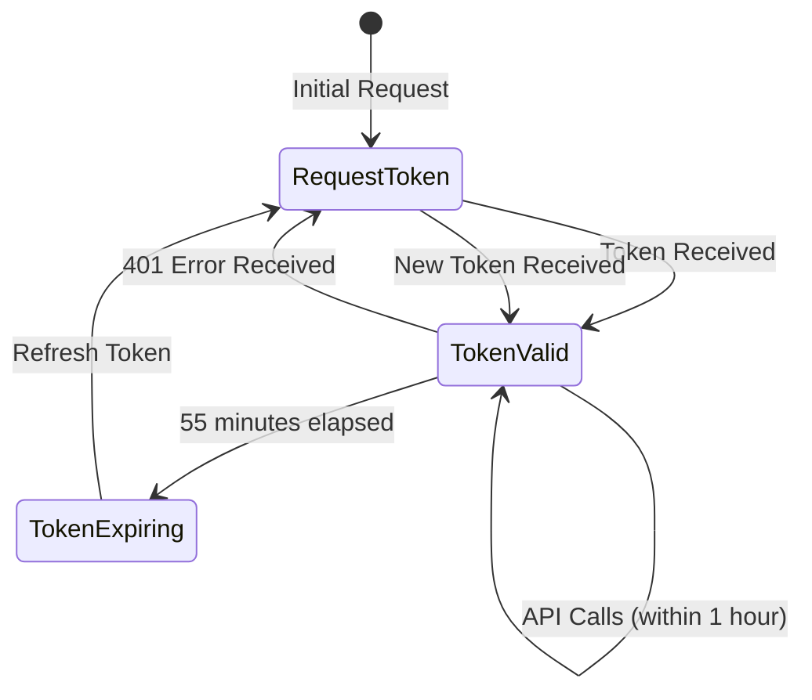

### 8.2 Token Expiration Details

- **Lifetime:** 3600 seconds (1 hour)
- **Refresh Window:** Refresh when < 5 minutes remaining
- **Caching:** Store token and expiration timestamp
- **Auto-refresh:** Implement automatic renewal before expiration

### 8.3 Renewal Strategy

**Recommended Approach:**
1. ✅ Cache the token and expiration time
2. ✅ Check token validity before each API call
3. ✅ Refresh token if it expires within 5 minutes
4. ✅ Use the same token endpoint with same credentials

**Token Management Flow:**
```
Check Token Cache
    ↓
Is Token Valid? (with 5 min buffer)
    ↓ Yes → Use Cached Token
    ↓ No
Request New Token
    ↓
Update Cache
    ↓
Use New Token
```

### 8.4 Error Handling

**401 Unauthorized Response:**
1. Token has expired
2. Request a new token using the same authentication endpoint
3. Retry the original request with the new token

**Implementation Pattern:**
```
API Call → 401 Error → Refresh Token → Retry API Call
```

---

## Step 9: Important Notes

### 9.1 Permission Types Comparison

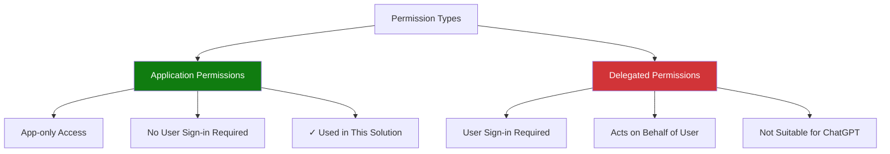

**Application Permissions** (used here):
- ✅ App-only access
- ✅ Works without user sign-in
- ✅ Required for ChatGPT integration

**Delegated Permissions:**
- ❌ Requires user sign-in
- ❌ Acts on behalf of the user
- ❌ Not suitable for automated systems

### 9.2 Endpoint Comparison

| Endpoint Type | Base URL | Use Case |
|---------------|----------|----------|
| **OneDrive** | `https://graph.microsoft.com/v1.0/me/drive/...` | Personal OneDrive files |
| **SharePoint** | `https://graph.microsoft.com/v1.0/sites/{site-id}/drive/...` | SharePoint site files |

**This solution uses OneDrive endpoints** as specified in requirements.

### 9.3 Security Best Practices

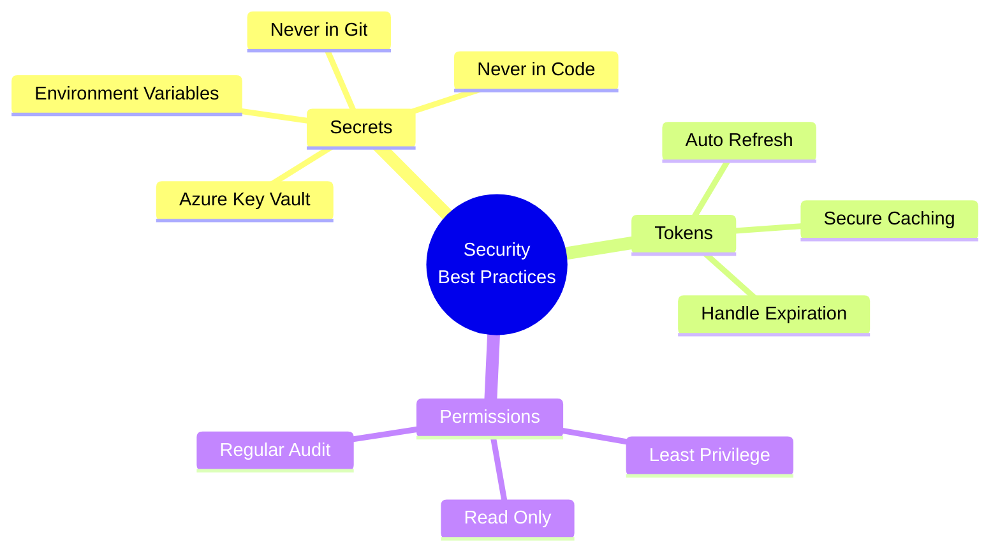

**Key Security Guidelines:**
1. **Secrets Management:**
   - ✅ Use environment variables
   - ✅ Never commit secrets to version control
   - ✅ Use Azure Key Vault for production

2. **Token Management:**
   - ✅ Cache tokens securely
   - ✅ Implement automatic refresh
   - ✅ Handle token expiration gracefully

3. **Permissions:**
   - ✅ Use least privilege principle
   - ✅ Only grant `Files.Read.All` (read-only)
   - ✅ Regular permission audits

---

## Step 10: Testing Checklist

- [ ] App Registration created
- [ ] Application permissions added (`Files.Read.All`)
- [ ] Admin consent granted
- [ ] Client secret created and saved
- [ ] Access token obtained successfully
- [ ] List files endpoint works
- [ ] Get file content endpoint works
- [ ] Get file metadata endpoint works
- [ ] Token refresh mechanism tested

---

## Troubleshooting

### Common Issues & Solutions

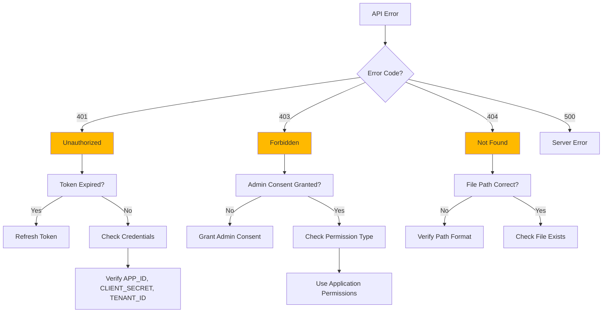

### Issue Resolution Guide

| Error Code | Issue | Solution |
|------------|-------|----------|
| **401 Unauthorized** | Token expired | Refresh token using same endpoint |
| **401 Unauthorized** | Invalid credentials | Verify APP_ID, CLIENT_SECRET, TENANT_ID |
| **401 Unauthorized** | Admin consent missing | Grant admin consent in Azure Portal |
| **403 Forbidden** | Permissions not granted | Grant admin consent for Files.Read.All |
| **403 Forbidden** | Wrong permission type | Use Application permissions (not Delegated) |
| **404 Not Found** | File path incorrect | Verify file path format and encoding |
| **404 Not Found** | File doesn't exist | Check file location in OneDrive |
| **Token Error** | Secret expired | Create new client secret in Azure Portal |
| **Token Error** | Wrong grant_type | Use `client_credentials` grant type |

---

## Next Steps

1. Complete Azure App Registration setup
2. Test authentication with provided examples
3. Integrate with your ChatGPT application
4. Implement error handling and token refresh
5. Deploy to your production environment

---

## Support Resources

- [Microsoft Graph API Documentation](https://docs.microsoft.com/en-us/graph/overview)
- [OneDrive API Reference](https://docs.microsoft.com/en-us/graph/api/resources/onedrive)
- [Azure AD Authentication](https://docs.microsoft.com/en-us/azure/active-directory/develop/v2-oauth2-client-creds-grant-flow)

---

**Document Version:** 1.0  
**Last Updated:** 2024

